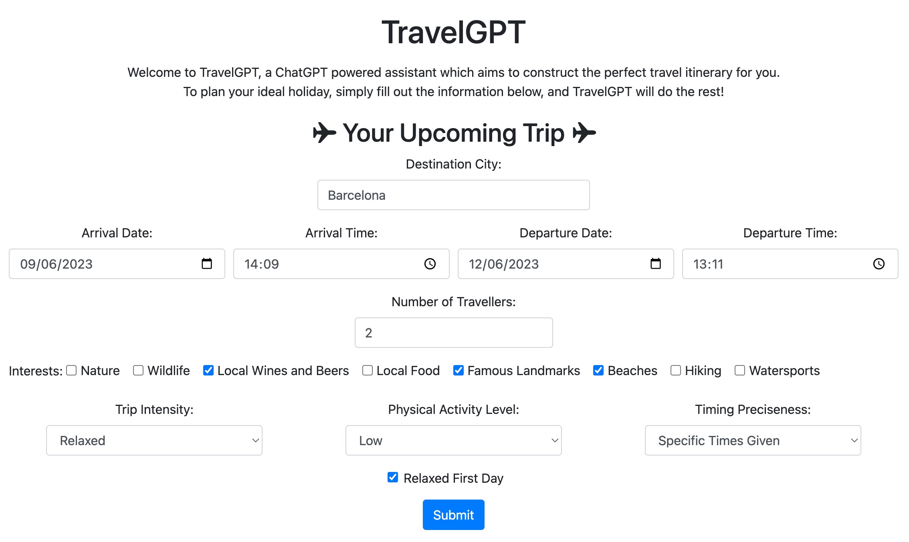
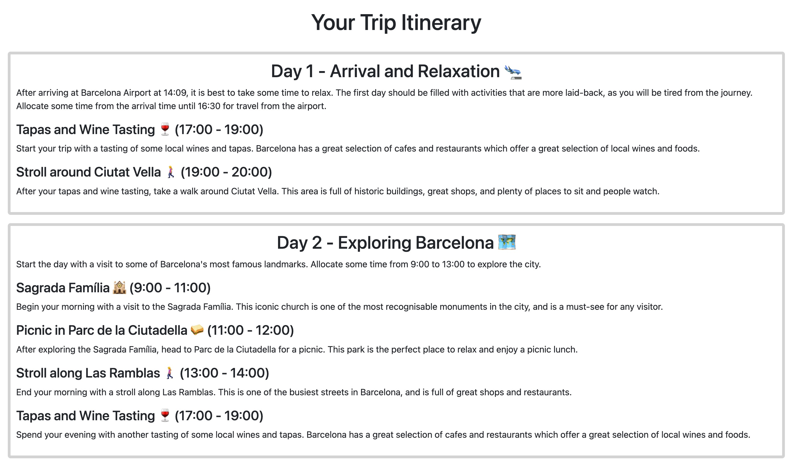

# Welcome to TravelGPT

## Contents

[Project Description](#project-description)  
[Project Demo](#project-demo)  
[Prompt engineering details](#prompt-engineering-details)  
[Testing and Contributing](#testing-and-contributing)

### Project Description

TravelGPT is a ChatGPT powered assistant which aims to construct the perfect travel itinerary for you.  
To plan your ideal holiday, simply fill out the information below, and TravelGPT will do the rest!

This repository is a working progress, with features still being implemented. Follow along!

### Project Demo

The website has been deployed using Vercel, and you can [interact with the user interface here](https://travel-gpt-tzrd.vercel.app/travel_plan/).  
Currently, the request takes too long for the Vercel free plan, so the "Submit" button doesn't do anything.  
To test the program, it is recommended to clone the repo, following the instructions in [Testing and Contributing](#testing-and-contributing)

Currently, the front-end interface, allowing the user to specify their vacation parameters, looks like this:  

When all parameters are filled in, you are redirected to a page which looks similar to this:  

### Prompt engineering details

This project relies heavily on prompt engineering to construct the desired output. The prompt engineering is done in the python function `construct_prompt(dict)` in the file `frontend/openai_api.py`. The function `construct_prompt(dict)` takes the dictionary of user input parameters as input, and uses each of these to construct the single best performing prompt.

Currently, the main sections of the prompt are as follows:
1. Output tone is set - TravelGPT is instructed to function as a travel agency, offering the best possible travel suggestions, tailored to the client's preferences.
2. User input is used - Information such as the client's arrival time, departure time, and interests is contained within a delimited section which is written from the client's perspective.
3. Output formatting - The output is specified to be in HTML format, with different days of the itinerary seperated into different sections, and text formatting instructions are given.
4. Activity timing and formatting - Additional instructions are given for formatting the timing of the trip, based on if the user prefers a precisely timed trip or a roughly timed trip.
5. Final reminders - Important parts, such as leaving enough travel time for getting to the airport, are reiterated once more.

These 5 steps currently give quite nice results using the `text-davinci-003` and `gpt-3.5-turbo` models. Less capable models ar eunable to generate the content in HTML formatting, and give less detailed activity descriptions. To use these models, such as `text-curie-001`, the output formatting would need to be created, and multiple prompts would need to be used, throughout multiple API calls.

Many papers such as [AutoML-GPT](https://arxiv.org/abs/2305.02499) have demonstrated that LLMs yield superior performance when complex prompts are broken down into smaller, step-by-step instructions, which are fed into the LLM one after the other. These smaller prompts can be generated by the LLM itself, allowing the user to, as the authors of the AutoML-GPT paper put it: "automatically utilizing LLMs to automate the training pipeline". This is a path which could potentially greatly improve the performance of this project, by constructing prompts which generate the itinerary for each day individually, according to prompts which are constructed based on the users preferences, and prompt engineered for optimal performance.

### Testing and Contributing

1. Navigate to the folder where you would like to store the project, with `cd <your/desired/folder_path>`.
2. Type `git clone https://github.com/Eschamp01/TravelGPT.git` into the command line.
3. Navigate to the [OpenAI API website](https://openai.com/blog/openai-api), log in, then [generate your API key](https://platform.openai.com/account/api-keys).
4. Create a '.env' file, with `touch .env`, and inside of this file insert the line `OPENAI_API_KEY = 'YOURKEY'`, replacing `'YOURKEY'` with the secret key which you obtain from teh OpenAI API website.
5. Install requirements with `pip install -r requirements.txt`. You may choose to do this in a virtual environment which you have created.
6. Start the application by hosting a local server: run `python manage.py runserver` in the command line.
7. Open your browser of choice, and navigate to the URL `http://localhost:8000/travel_plan/`. Fill in some information about your holiday, and press "Submit". Your travel itinerary will be generated for you shortly!
